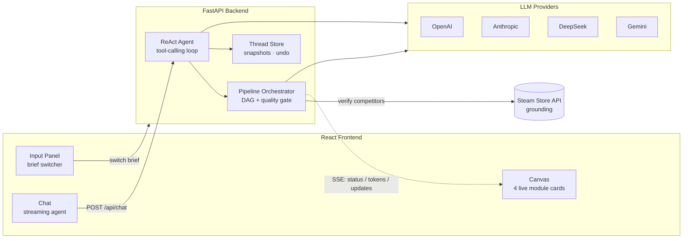
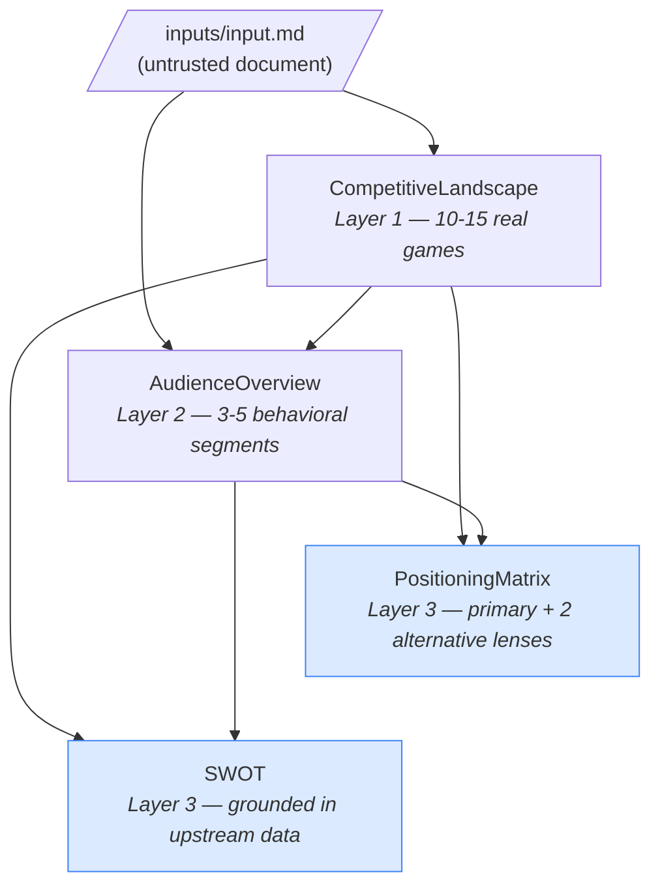
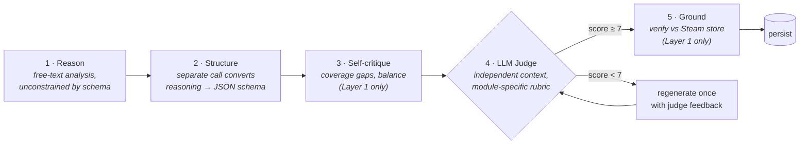
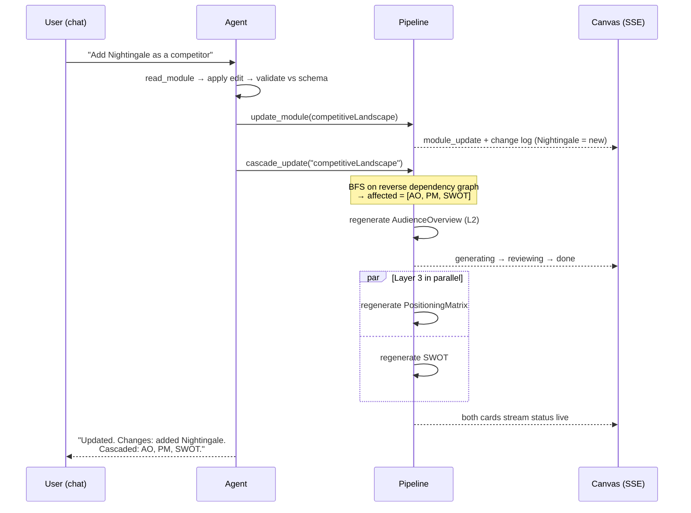
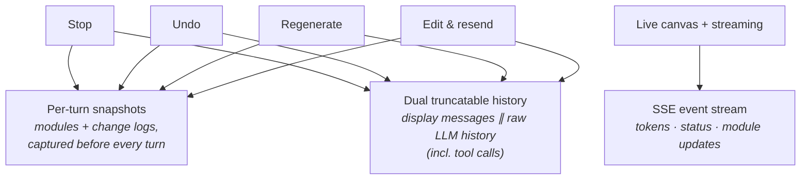
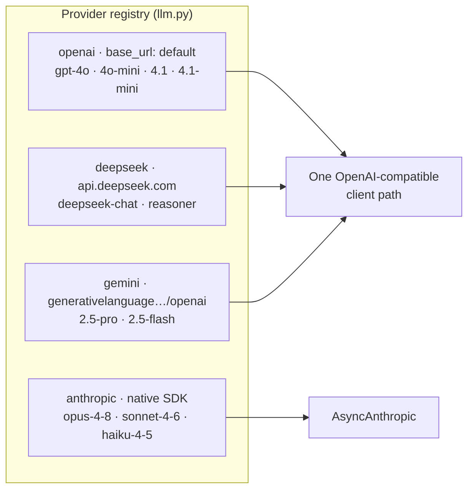

# GTM Agent — Go-To-Market Analysis System


**GTM Agent is an AI analyst for game publishers.** Drop in a short brief describing a game — its genre, platform, price — and it researches the competitive market and writes a complete go-to-market analysis: who you're competing with, who your players are, where you sit on the strategic map, and your strengths, weaknesses, opportunities, and threats.

The analysis isn't a static report. It's a **living document you talk to**: tell the chat agent *"add Nightingale as a competitor"* and it updates the competitive landscape, then automatically rewrites every downstream section that depends on it — while you watch each card regenerate in real time. Disagree with a change? One click undoes it, modules and all.

> 🎬 **Full demo (4 min, with narration)** — generating the analysis, chat-driven cascade updates with live parallel regeneration, quality reviews and Steam verification, cross-module exploration, quoting, undo, and export:

https://github.com/user-attachments/assets/ab85ec69-2070-409f-a655-0ab848491838

### What makes it more than a wrapper around an LLM

- **It checks its own work.** Every section is scored by an independent AI judge against a per-section rubric; weak output is regenerated with the judge's feedback. Scores are shown on each card.
- **It doesn't hallucinate games.** Every competitor is verified against the real Steam store — verified titles get a ✓ badge, misses get flagged (not deleted: console exclusives are real competitors too).
- **It understands dependencies.** The four sections form a dependency graph. Edits cascade to exactly the affected sections, in the right order, never more.
- **Every change is accountable.** Removed items stay visible as strikethrough, new items get badges, every section keeps its last 10 versions with diffs, and any chat turn can be undone, regenerated, or edited — state and conversation revert together.
- **The chat feels like ChatGPT.** Streaming replies, multiple named conversations, quote anything on the page (select text or click a section), stop generation mid-flight — with partial changes safely rolled back.
- **Bring your own model.** Eleven models across OpenAI, Anthropic, DeepSeek, and Gemini, switchable at runtime; paste API keys in the UI (stored locally, never echoed back).
- **It's hardened and proven.** Prompt-injection defenses, schema validation on every write, path-traversal and key-leak protections — each one verified by a named test in the 50-test suite, including one that *deadlocks if parallel execution were faked*.

Everything below is the technical deep-dive.

---

## Table of Contents

- [System Overview](#system-overview) · [Assignment Coverage](#assignment-coverage)
- [Architecture](#architecture) · [Generation Methodology](#generation-methodology) · [Cascade Engine](#cascade-engine)
- [The Chat System's Three Primitives](#the-chat-systems-three-primitives)
- [Multi-Provider Design](#multi-provider-design) · [Security Model](#security-model) · [Testing](#testing)
- [Quick Start](#quick-start) · [Running Each Tier](#running-each-tier)
- [Design Details Worth Noticing](#design-details-worth-noticing) · [Trade-offs](#trade-offs)

---

## System Overview

Given a game brief (`inputs/*.md`), the system generates four structured GTM modules with a **fixed dependency DAG**, then lets you refine them through a chat agent that understands the graph — change an upstream module and every affected downstream module regenerates, in topological order, with Layer 3 in parallel.



## Assignment Coverage

| Tier | Requirement | Where | Beyond the requirement |
|------|-------------|-------|------------------------|
| **1** | Pipeline as a Claude Code skill, L1→L2→L3 order, L3 parallel | [`.claude/skills/gtm-analyze/`](.claude/skills/gtm-analyze/SKILL.md), [`backend/pipeline.py`](backend/pipeline.py) | Parallelism is **proven by a test that deadlocks if execution were sequential** |
| **2** | Cascade updates, topological order, affected-only | [`backend/pipeline.py`](backend/pipeline.py) `cascade_update` | Field-level diff reporting; accumulated change history rendered as strikethrough/new badges |
| **3** | Conversational agent from raw LLM API | [`backend/agent.py`](backend/agent.py) | Custom ReAct loop, streamed; handles ambiguous & out-of-scope requests by design |
| **4** | Three-column real-time frontend | [`frontend/src/`](frontend/src) | Multi-thread chat with undo/regenerate/edit/quote/stop; dark mode; version history with diffs |

---

## Architecture

### The dependency DAG



Layer 3 (blue) runs under `asyncio.gather` — genuinely concurrent, not just "two calls in a row". The dependency edges are *structural*, not stylistic: `AudienceOverview.segments[].selectedExistingCompetitors` must reference names that exist in `CompetitiveLandscape`, and the backend **validates and prunes invalid references** on every write path (generation *and* agent edits).

### Per-brief workspaces

Every brief in `inputs/` gets an isolated workspace under `output/<brief-stem>/` holding its module JSONs, change log, version history, and quality reviews. Switching briefs in the UI swaps the entire canvas, chat thread, and agent context — two games never bleed into each other (covered by `test_workspace_isolation`).

---

## Generation Methodology

The evaluation brief asks: *"a single dump prompt or something more considered?"* Each module goes through up to **five distinct stages**:



Why each stage exists:

1. **Reason-then-structure** — models think better in prose than inside a JSON straitjacket. Splitting the calls measurably improves rationale specificity.
2. **Schema validation with retry** — every structured output is validated against Pydantic models; on failure the *validation error itself* is fed back for up to 2 corrective retries.
3. **Self-critique** — the landscape reviews itself for coverage gaps across competition dimensions (genre, IP, monetization, audience overlap).
4. **LLM-as-judge** — a *separate context* scores 0–10 against per-module rubrics (real games only, behavioral not demographic segmentation, axes that reveal strategy, SWOT items that name names). Below 7.0 → one feedback-guided regeneration. Same principle as code review by a second engineer: the judge isn't anchored on the generator's reasoning. Scores render as chips on each card. Toggle with `QUALITY_GATE=off`.
5. **Steam grounding** — anti-hallucination. Every competitor is checked against the Steam store search API (concurrent, fuzzy name match, fail-open). Verified titles get a `✓ Steam` badge + appId; misses are flagged but **not removed** — Animal Crossing is a real competitor even though it's a Switch exclusive. The flag is information, not a filter.

Two more methodology details:

- **Axis stability** — when a cascade regenerates the PositioningMatrix, the previous axes are passed in with an instruction to keep them unless upstream changes invalidate them. Users compare positions across updates; silently changing axes breaks that.
- **Self-explanatory axis labels** — endpoint labels must be standalone phrases ("Solo Survival", never "Low"); the UI additionally falls back to combining bare words with the axis name.

---

## Cascade Engine

The assignment's sample test — *"Add Nightingale to the competitive landscape"* — end to end:



Design decisions that took iteration to get right:

- **Affected-only, never blind.** BFS over the reverse dependency graph. Editing SWOT cascades to nothing; editing the landscape cascades to exactly three modules, layer by layer.
- **Change history records *intent*, not churn.** Direct user edits accumulate an add/remove log (rendered as strikethrough + `new` badges, surviving across chat rounds). Cascade regenerations *reset* that module's log — a re-derived module has no item-level lineage to its old version, and pretending otherwise produced noise (e.g. the matrix "removing" games that were merely re-selected).
- **The agent reports what changed**, not just what ran: a field-level diff ("added to existingCompetitors: Nightingale") is computed backend-side and folded into the reply.

---

## The Chat System's Three Primitives

Every ChatGPT-style feature here — **stop, undo, regenerate, edit-and-resend, multi-thread history** — is a composition of three primitives rather than five separate mechanisms:



- **Stop** cancels the in-flight asyncio task, rolls partial module writes back to the pre-turn snapshot, and truncates dangling tool calls from the LLM history (a half-finished tool call would corrupt the next API request).
- **Undo** restores the snapshot *and* removes the exchange — modules, change logs, and conversation revert together.
- **Regenerate** restores the snapshot *before* re-running, so a turn that performed edits doesn't double-apply them.
- **Edit-and-resend** truncates both histories at the edited message and restores the matching snapshot from the stack (capped at 5/thread).
- Threads persist server-side (`output/_threads.json`), are bound to their brief (selecting an old thread switches the workspace back), and support rename/delete.

Everything renders live: agent tokens stream into a draft bubble, the chat shows a per-module progress list (spinner → purple *reviewing* → green check), and cards dim with a shimmer bar while regenerating. Token events go to SSE only — they're filtered out of the HTTP payload and the persisted thread.

---

## Multi-Provider Design



The insight: DeepSeek and Gemini expose **OpenAI-compatible endpoints**, so three providers share one client path differing only in `base_url`. Adding a provider is a 5-line registry entry. The agent's tool-calling loop also follows the active provider when it speaks OpenAI-compatible function calling (with `deepseek-reasoner` auto-mapped to `deepseek-chat`, which supports tools); only Anthropic — a different tool protocol — falls back to OpenAI for the agent.

**Key handling:** users paste keys in the settings modal → stored in the backend's gitignored `.env` + applied live. The API exposes *availability booleans only* — key material never appears in any response (asserted by a test that whitelists the exact response fields). Model strings are whitelisted per provider, so arbitrary strings can't be forwarded to upstream APIs.

---

## Security Model

| Threat | Defense | Verified by |
|---|---|---|
| Prompt injection hidden in a game brief | Brief wrapped in `<game_brief>` delimiters with a data-not-instructions notice placed *after* the payload (recency wins); agent system prompt instructs flagging, not following | `test_injection_phrases_survive_wrapping` |
| Malformed agent tool output corrupting modules | Full Pydantic schema validation before any write; audience cross-references checked and pruned | `test_tool_update_rejects_malformed_schema` |
| API key exfiltration | Keys live in gitignored `.env`; settings responses field-whitelisted; export checked for leaks; `.env` unreachable over HTTP | `test_api_key_never_echoed`, `test_dotenv_not_served`, `test_export_does_not_leak_secrets` |
| Attribute probing (`/api/modules/__class__`) | Module names whitelisted against the dependency graph — no `getattr` on user input | `test_module_endpoints_reject_internals` |
| Path traversal via brief selection | Filenames matched against an enumerated allowlist, never joined into paths | `test_input_selection_path_traversal` (5-variant corpus) |
| Token-bomb / oversized inputs | Length bounds on messages (8k), titles, keys, thread ids | `test_chat_message_bounds` |
| CSRF-adjacent cross-origin calls | CORS restricted to the dev frontend origin | `test_cors_rejects_foreign_origin` |
| Inconsistent state from a cancelled generation | Stop rolls back to the pre-turn snapshot and repairs LLM history | exercised live; logic shared with undo (`test_snapshot_restore_roundtrip`) |

Secrets hygiene for this repo itself: full git history scanned for key patterns before publishing; `.env` was never committed.

---

## Testing

```bash
PYTHONPATH=. pytest tests/ -v        # 50 tests, ~0.7s, zero LLM calls
```

| Suite | Focus | The interesting bit |
|---|---|---|
| `test_system.py` (23) | Cascade graph, change-log semantics, version capping, snapshot round-trips, JSON-parsing edge cases, API misuse | Dependency graph proven acyclic via Kahn's algorithm |
| `test_orchestration.py` (11) | Full pipeline with mocked generators | **Parallelism is proven, not observed**: the L3 fakes cross-wait on each other's start events — sequential execution deadlocks and fails the test |
| `test_security.py` (16) | The entire table above | Key-handling test asserts the *exact* response field set, so a future field addition that leaks data fails CI |

All suites mock the LLM layer — the full matrix runs in CI with no API keys and no cost.

---

## Quick Start

```bash
git clone git@github.com:Lancel0tz/gtm-agent.git && cd gtm-agent

pip install openai anthropic httpx pydantic python-dotenv fastapi uvicorn
cd frontend && npm install && cd ..

export OPENAI_API_KEY="sk-..."   # or paste keys later in the in-app settings (⚙)

# Terminal 1 — backend
PYTHONPATH=. uvicorn backend.main:app --reload --port 8000
# Terminal 2 — frontend
cd frontend && npm run dev       # → http://localhost:5173
```

Try, in order: **"Generate the full GTM analysis"** → watch the four cards stream through generating/reviewing → **"Add Nightingale as a competitor"** → watch the cascade → click a competitor for its cross-module card → select any text → **Quote in chat** → hit **undo** under the agent's reply.

## Running Each Tier

| Tier | Command |
|---|---|
| 1 — Pipeline / skill | `PYTHONPATH=. python -m backend.run_pipeline` (or `/gtm-analyze` in Claude Code; skill at [`.claude/skills/gtm-analyze/`](.claude/skills/gtm-analyze/SKILL.md)) |
| 2 — Cascade CLI | `PYTHONPATH=. python -m backend.run_cascade competitiveLandscape` |
| 3 — Agent API | `PYTHONPATH=. uvicorn backend.main:app --port 8000` then `POST /api/chat` |
| 4 — Frontend | backend + `cd frontend && npm run dev` |

Sample outputs for two briefs (Dune: Awakening and a contrasting cozy farming sim, Moonhaven) are committed under [`output/`](output) so the result quality is inspectable without running anything.

---

## Design Details Worth Noticing

Small decisions that don't fit a diagram:

- **Real-time means real-time.** Status events are emitted from *inside* the pipeline the moment they happen — an early version buffered events until the agent's turn completed, which technically "updated the canvas" but defeated the point. The fix (an `on_event` callback threaded through the pipeline) is why you see `generating → reviewing → done` progress live during a 2-minute cascade.
- **Module-level quoting.** Charts and SWOT grids resist text selection, so every card has a quote button that serializes the whole module into a readable quote chip — alongside free text-selection quoting with a floating button.
- **Esc closes the top layer only.** Modal Esc handling is centralized with explicit layer priority (entity popover → module detail), instead of N competing listeners closing random layers.
- **Entity popovers are cross-module joins.** Click any competitor: its rationale (L1), which segments play it (L2), its position highlighted on a mini-matrix (L3), and the SWOT items naming it (L3) — one card showing the DAG's connective tissue.
- **Alternative positioning lenses.** The matrix ships with two extra axis pairs (e.g. monetization × content cadence) as an *optional* schema field — the spec'd schema is untouched, and the chosen lens persists between the card and detail view.
- **Suggestion prompts adapt.** The Dune brief offers the spec's official Nightingale test case as a one-click suggestion; other briefs get suggestions built from their own competitors.
- **Generic brief parsing.** Key facts (title/genre/platform/price) are regex-extracted from any brief structure — nothing about the Dune brief is hardcoded (an early bug: SWOT prompts said "Dune: Awakening" literally; now everything derives from the brief).
- **Export carries the evidence.** The one-click Markdown report includes Steam verification flags, all three positioning lenses, and the judge's scores — the methodology travels with the output.

## Trade-offs

- **Agent on OpenAI-compatible protocols only** — Anthropic's tool-use format differs; bridging it was lower value than the judge/grounding work. Module generation runs on all four providers.
- **SSE over WebSocket** — one-directional push is all the canvas needs; chat requests are plain POSTs. Less infrastructure, same UX.
- **Snapshots capped at 5/thread** — unbounded undo history would bloat the thread store for marginal value; edits older than the window still truncate conversation correctly, just without module rollback.
- **Steam as the single grounding source** — free, keyless, and covers the PC market this brief targets. The `verified` field is deliberately tri-state (`true/false/null`) so additional sources (console storefronts, IGDB) can slot in without schema changes.
- **File-based persistence** — JSON files per workspace beat a database for a reviewable take-home: every artifact is diffable in git. The `Pipeline` class is the single owner of all state, so swapping in SQLite later touches one file.
